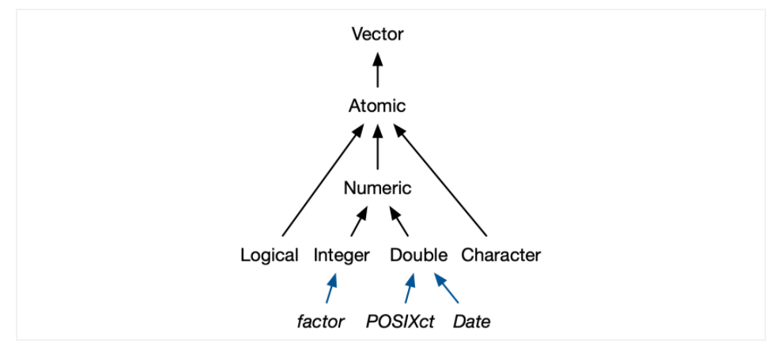

---
title: "Data Structures"
subtitle: "lession 2"
author: "Eviatar Guttman"
date: "Last updated: `r format(Sys.time(), '%d-%m-%Y')`"  
output: 
  html_document: 
    toc: yes
    toc_depth: 3
    toc_float: yes
    number_sections: yes
    toc_collapsed: no
    smooth_scroll: yes
    fig_caption: yes
    highlight: tango
    theme: flatly
    css: ../style.css
urlcolor: blue
editor_options: 
  chunk_output_type: console
---  

```{r setup, include = F}
# global chunk options
knitr::opts_chunk$set(echo = TRUE,
                      warning = T,
                      message = T,
                      error = T,
                      tidy=TRUE,
                      fig.align = 'center',
                      fig.asp = 5/7,
                      collapse = TRUE)

# don't show NA's in tables
options(knitr.kable.NA = '')

```

```{r}
library(tidyverse)
```

# Vectors  
<div dir="rtl">
ניתן לחלק ווקטורים לשני סוגים:  
1.	ווקטור אטומי; לוגי, נומרי (integer או double), טקסט (character), מרוכב, raw.     
2.	רשימה `list`.     
</div>  
## atomic vectors
### introduction
```{r echo=FALSE, out.width='90%'}

```

<div dir="rtl">
וקטור אטומי הוא הומוגני, כל הרכיבים בו הם מאותו סוג. זאת, בעוד ש- `list` יכול לכלול רכיבים מסוגים שונים.   
`NULL` זה ההיפך מווקטור. Absence of a vector.   (`NA` זה ההיפך מערך בווקטור, absence of a value).     
`NULL` מתנהג כמו ווקטור באורך 0.    
  
לווקטור יש `type` ו-`length`: 
</div>

```{r}
letters

typeof(letters)

length(letters)

1:10

typeof(1:10)

x <- list("a", "b", 1:10)

x

length(x)
```

<div dir="rtl">
בווקטורים עשוי להיות מידע נוסף המתאר את הנתונים, metadata.    
ה-metadata מאוחסן ב-`attributes` של הווקטור.  זה מאפשר ליצור הרחבות (extension)  לווקטורים.   
למשל, `Factors` המשמשים לאחסון מידע קטגורי בנויים על בסיס ווקטור `integer`.   
`Date` וגם `date-times` המשמשים לאחסון מידע על תאריכים וזמנים בנויים על בסיס ווקטור `double`.   
`Data frames` בנויים על  בסיס `list`.     
</div>


### logical  
<div dir="rtl">
ווקטור לוגי יכול לקבל שלושה ערכים: `TURE`, `FALSE`, `NA`.   הוא נוצר בד"כ בהשוואה:
</div>

```{r}
2 > 3

c(1, 2, 3, 4) > 3

1:5 %% 3 == 0 
```

:::{.pink-box}
<div dir="rtl">
מוטב לשהתמש בשם המלא של הערכים הלוגיים
</div>
```{r}
c(T, T, F)

T <- FALSE

c(T, T, F)

# use full name TRUE and FALSE: 
c(TRUE, TRUE, FALSE)

rm(T)
```

:::

### numeric
Integer and Double vectors: 
```{r}
typeof(1)

typeof(1L)
```

<div dir="rtl">
__אבחנה בין `integer` לבין `double`:__    
`double` הוא קירוב למספר. `double` מייצג מספרי floating-point אשר לא תמיד ניתן לייצג אותם בכמות זיכרון קבועה. 
</div>


```{r}
x <- sqrt(2) ^ 2

x

x - 2
```

<div dir="rtl">
ב-`integer` יש רק ערך מיוחד אחד- `NA`.      
ב-`double` יש ארבעה ערכים מיוחדים: `NA`, `NaN`, `Inf`, `-Inf`.   
</div>

```{r}
(x <- c(-1, 1, 0, NA) / 0)

# to check these properties use: 
is.finite(x)

is.infinite(x)

is.na(x)

is.nan(x)
```

<div dir="rtl">
מקרים יוצאי דופן של ערכים חסרים: 
</div>
```{r}
NA ^ 0

NA | TRUE

NA & FALSE
```
### Character 
:::{.pink-box}
In R, a piece of text is represented as a sequence of characters (letters, numbers, and symbols). The data type R provides for storing sequences of characters is `character`. Formally, the mode of an object that holds character strings in R is `character`.
:::


<div dir="rtl">
אנו נחליף בין המושגים character ו-string באופן תכוף.   
Character string זו מחרוזת תווים.    
  
בכדי לייצג string, תוחמים את הטקסט במירכאות – בודדות `'` או כפולות `"`.   
  
רכיב בווקטור `character` יכול להכיל  string באורך כלשהו: 
</div>


```{r}
x <- "My name is Eviatar Guttman and this is one string"

y <- "43"

c(x,y)
```

### Coercion 
<div dir="rtl">
Coercion זו "כפיה" או "היאלצות".  זה מתייחס למצב בו ווקטור מסוג מסוים הופך לווקטור מסוג אחר. 
</div>
__Explicit coercion__  

```{r}
(x <- 0:5/3)

as.integer(x)

as.character(x) 

as.logical(x) 

y <- c("1","2","3", "a", "b")

as.double(y) 


```

__Implicit coercion__  

<div dir="rtl">
בווקטור לוגי `TRUE` הופך ל-1 , ו- `FALSE` הופך ל-0.
</div>

```{r}
x <- c(TRUE, TRUE, FALSE)

sum(x)

mean(x)
```


```{r}
(x <- sample(3, 6, replace = TRUE))

(y <- x > 1)

sum(y)  

mean(y) 

length(x) >  10

if ( length(x) > 10) {
  "x is long"
} else {
  "x is short"
}
```


<div dir="rtl">
כאשר ניצור ווקטור המכיל כמה סוגים של ערכים, הסוג המורכב ביותר ינצח: 
</div>
```{r}
typeof(c(TRUE, 1L))

typeof(c(1L, 1.5))

typeof(c(1.5, "a"))
```

<div dir="rtl">
ווקטור אטומי לא יכול להכיל סוגים שונים של ערכים משום שהסוג הוא מאפיין (property) של הווקטור כולו.   
מרבית הפונקציות המתמטיות (לוג, ערך מוחלט, +) יהפכו את הווקטור ל-`numeric`. 
</div>

### recycling rules
```{r}
1:6

1:2

1:6 + 1:2 

# What happened is: 
# 1 + 1,  2 + 2,  3 + 1,  4 + 2,  5 + 1,  6 + 2
```
<div dir="rtl">
אותו עקרון כמו:
</div>
```{r}
1:5 + 20
# there are no scalars, its a vector of length 1.
```
<div dir="rtl">
אין סקלרים, יש וקטור באורך 1.   
    
ניתן לנצל זאת כאשר יוצרים `data.frame`:
</div>
```{r}
data.frame(v1_long = 1:6,
           v2_short = 1:2)
```
<div dir="rtl">  
אם אורך ווקטור אחד אינו מכפלה של הווקטור האחר, אפשר לקבל `warning` או `error`. 
</div>  
```{r}
1:10 + 1:3

data.frame(v1_long = 1:10,
           v2_short = 1:3)

```


### naming vectors
<div dir="rtl">
ניתן לקצות שמות לרכיבים בווקטור
</div>
```{r}
c(x = 1, y = 2, z = 4)

(x <- c(1, 2, 4))

names(x)<- c("a", "b", "c")

x

x <- set_names(x, c("w", "x", "y"))

x
```

### Make vector longer 
```{r}
c(x, 10:12)

c(c(1:2), c(5:6)) # c() flattens the vector 
```
### exercise   
  
1. Why is `1 == "1"` true?  
Why is `-1 < FALSE` true?  
Why is `"one" < 2` false?    
  
<div dir="rtl">  
2. בדקו מה בדיוק הפונקציות הבאות עושות:
`is.atomic`, `is.numeric`, `is.vector`.    
</div>  

    
## lists

<div dir="rtl">
`list`  יכול לכלול בתוכו `lists` אחרים. תכונה זו הופכת אותו מתאים לייצוג נתונים היררכיים או מבנה בצורת עץ.
</div>
    
```{r}
x <- list(1, 2, 3)

x

str(x)
 
x_named <- list(a = 1, b = 2, c = 3)

str(x_named)
```
<div dir="rtl">
`list`  יכול לכלול סוגים שונים של אובייקטים.
</div>
    
```{r}
y <- list("a", 1L, 1.5, TRUE)

str(y)
```
<div dir="rtl">
`list`  יכול לכלול בתוכו `lists` אחרים.
</div>
```{r}
z <- list(list(1, 2), list(3, 4))

str(z)


x1 <- list(c(1, 2), c(3, 4))
x1

x2 <- list(list(1, 2), list(3, 4))
x2

x3 <- list(1, list(2, list(3)))
x3
```
<div dir="rtl">
`list`  שימושי לאובייקטים גדולים.     
לדוגמא, תוצאות רגרסיה ליניארית, או תוצאות של תרשים נשמרות ב-`list`. 
</div>

```{r}
regression <- lm(mpg ~ cyl + wt, data = mtcars)
```

```{r echo=FALSE, out.width='90%'}

```

## attributes

<div dir="rtl">
מטה-דאטה, `metadata`, מידע המתאר את הנתונים נשמר ב-`attributes` של הווקטור. 
  
מטה-דאטה חשובים הם:   
-	שמות של רכיבים בווקטור  
-	ממדים (בקיצור dim) שגורמים לוקטור להתנהג כמו `matrix` או `array`.  
</div>
    
```{r}
x <- 1:6

class(x)

dim(x) <- c(2,3)

x

class(x)
```

:::{.blue-box}
3.`Class` is used to implement the S3 object oriented system.  
Here are four different implementations of the function `summary()`  
```{r}
summary(1:10)

summary(c(TRUE, TRUE, TRUE, FALSE))

summary(letters)

summary(as.factor(c("a", "b", "b", "b")))
```

`summary()` is a generic function.    
You can see all the functions that exist in your R sessions memory that are called by this name by calling the function `method()`:  

```{r}
methods("summary")
```
Class controls how generic functions work.  
Generic functions are key to object oriented programming in R, because they make functions behave differently for different classes of input.  
  
If x is a factor vector, `summary()` will call `summary.factor()`.    
If x is a linear regression output, `summary()` will call `summary.lm()`.   
:::

## Augmented vectors 
### factors
<div dir="rtl">
`Factors` משמשים למידע קטגורי. קבוצת הערכים האפשריים שלהם קבועה. 
`Factors` בנויים על `integers`, ויש להם `attribute` של `levels`.
</div>


```{r}
x <- factor(c("ab", "cd", "ab"), levels = c("ab", "cd", "ef"))

x

typeof(x)

attributes(x)

as.numeric(x) # gives the integer representation
```

<div dir="rtl">
יש להיזהר ממקרים כאלה
</div>

```{r}
(y <- factor(c("-1", "0", "1", "2")))

as.numeric(y)

as.numeric(as.character(y))
```

### dates
<div dir="rtl">
`Dates` הם ווקטורים נומריים המייצגים את מספר הימים מאז הראשון לינואר 1970
</div>
```{r}
x <- as.Date("1971-01-01")

unclass(x)

typeof(x)

attributes(x)
```

## exercise 
<div dir="rtl">
1. מה הפונקציה `dim` מחזירה כאשר קוראים לוקטור בעל ממד יחיד?   
2. איזה סוג אובייקט הפונקציה `table` מחזירה? מהם ה-`attributes` של האובייקט? איך הממדים משתנים כאשר מזינים לתוך הפונקציה יותר משתנים?   
3. מה קורה ל-`factor` כאשר משנים את ה-`levels` שלו?   
</div>
```{r, eval = F}
f1 <- factor(letters)
levels(f1) <- rev(levels(f1))
```
<div dir="rtl">
4. מדוע צריך להשתמש בפונקציה `unslist` כדי להפוך `list` לווקטור, מדוע `as.vector` לא עובד?   
</div>


## data.frame
```{r}
x <- data.frame(A = 1:5, B = letters[1:5])

x

typeof(x)

class(x)

attributes(x)
```
<div dir="rtl">  
ב-`tidyverse` יצרו הרחבה ל-`data.frame` הנקראת `tibble`, על מנת לשנות חלק מהתכונות כך שיתאימו לגישתם. 
</div>  
:::{.blue-box}  
"Tibbles are data frames, but they tweak some older behaviours to make life a little easier. R is an old language, and some things that were useful 10 or 20 years ago now get in your way.  
  
If you’re already familiar with data.frame(), note that tibble() does much less: it never changes the type of the inputs (e.g. it never converts strings to factors!), it never changes the names of variables, and it never creates row names."  
Hadly Wickham
:::
```{r}
x <- tibble(
  x = 1:5, 
  y = 1, 
  z = x ^ 2 + y
)

class(x)
```

## exercise  
<div dir="rtl">  
1. האם יתכן `data.frame` עם 0 שורות? האם ייתכן עם 0 עמודות?   
2. מה קורה כאשר מפעילים על `df`  את  הקוד הבא: `t(df)`, `t(t(df))`? בצע בדיקות כאשר בטבלה יש ווקטורים מסוגים שונים.   
3. מה הפונקציה `as.matrix`  עושה כאשר מפעילים אותה על `data.frame` עם עמודות מסוגים שונים?   
</div>  


# subsetting
<div dir="rtl">
יש שלושה אופרטורים לביצוע sub-setting: `$`, `[`, `[[`.    
האופרטורים הללו מתנהגים שונה באינטראקציה עם ווקטורים מסוגים שונים
</div>

## multiple elements 
### Atomic vectors 
<div dir="rtl">
`[` משמש לסנן מספר כלשהו של רכיבים בווקטור
</div>
```{r,  error=TRUE}
(x <- c(2.1, 4.2, 3.3, 5.4))

x[c(3, 1)]

order(x)
# order() takes a vector and returns an integer vector describing how to order it

x[order(x)]

x[order(-x)]

# Duplicate indexes will duplicate values
x[c(1, 1)]

# Real numbers are silently truncated to integers
x[c(2.1, 2.9)]

# negative integers
x[- c(3, 1)]

x[c(- 1, 2)] 

# Logical vectors select the position of  TRUE values
x[c(TRUE, TRUE, FALSE, FALSE)]

x > 4

x[x > 4]

# All even (or missing!) values of x
x %% 2 == 0

x[x %% 2 == 0]

```
recycling rules: 
```{r}
x[c(TRUE, FALSE)]

# Equivalent to
x[c(TRUE, FALSE, TRUE, FALSE)]
```
missing yields missing
```{r}
x[c(NA, TRUE, FALSE, NA)]
```

<div dir="rtl">
סינון ערכים חסרים: 
</div>
```{r,  error=TRUE}
x <- c(2.1, 4.2, NA, 5.4, 3.5, NA)

!is.na(x)

x[!is.na(x)]

```

nothing (useful for multidimensional data)
```{r}
x[] 

x[0]
```
<div dir="rtl">
וקטור עם שמות: 
</div>
```{r}
x <- c(2.1, 4.2, 3.3, 5.4)
y <- setNames(x, letters[1:4])
y

y[c("d", "c")]
```

<div dir="rtl">
כאשר מסננים עם `[` שמות תמיד יותאמו לערכים על השם במלואו. 
</div>
```{r}
y <- c(abc = 2.1, def = 4.2, g = 3.3)

y[c("a", "d")]

y[c("abc", "def")]

```
<div dir="rtl">
להבדיל, ה- `$` אשר עושה גם partial matching. 
</div>
<br>
<div dir="rtl">
סינון באמצעות `factor` ישתמש באינדקסים של ווקטור ה-`integer` בנמצא בבסיס הווקטור.  
לא כדאי להשתמש בזה: 
</div>  
```{r}
y[factor(c("B", "A"))]

# note that factor levels are ordered alphabetically:
factor(c("A", "B"))
```

### matrices

```{r}
a <- matrix(11:19, nrow = 3)

colnames(a) <- c("A", "B", "C")

a
```
<div dir="rtl">
מצד שמאל לפסיק זה שורות, מצד ימין לפסיק זה עמודות
</div>
```{r}
a[1:2, ]

a[c(TRUE, FALSE, TRUE), c("B", "A")]

a[0, -2]
```

<div dir="rtl">
האופרטור `[` מפשט את התוצאה לממד הנמוך ביותר האפשרי.   
סינון שורה אחת במטריצה יהפוך את התוצאה מ-`matrix` לווקטור.
</div>
```{r}
a 

class(a)

a[1, ]

class(a[1,])

class(a[, 1])
```

<div dir="rtl">
משום שמטריצה היא פשוט וקטור עם תוספת `attributes` למימד, אפשר לסנן חלקים ממנו עם וקטור יחיד, כאילו היו בממד אחד. 
</div>
```{r}
a[c(1,5,9)]
```

### data frames
<div dir="rtl">
ל-`data.frame` יש במקביל את התכונות של `matrix` וגם של `list`.  
  
כאשר מסננים באינדקס יחיד, הן מתנהגות כמו `list` והאינדקס קובע את מספר העמודה שתסננו. למשל, `df[1:2]` יסנן את שתי העמודות הראשונות.       
כאשר מסננים בשני אינדקסים הן מתנהגות כמו `matrix`. למשל, `df[1:3, ]` יסנן את שלושת השורות הראשונות (וכל העמודות).  
</div>


```{r}
(df <- data.frame(x = 1:3, y = 4:6, z = letters[1:3]))

# like a list
df[1:2]

# like a matrix
df[ , 1:2]

# first two rows
df[1:2, ]

# like a list
df[c("x", "z")]

# like a matrix
df[, c("x", "z")]
```

<div dir="rtl">
יש הבדל מהותי בין האופרטורים אם מסננים עמודה אחת. סינון באמצעות `matrix` מפשט את התוצאה לווקטור. סינון באמצעות `list` לא עושה זאת. 
</div>

```{r}
str(df["x"])

str(df[, "x"])
```

### preserve dimentions
<div dir="rtl">
סינון מטריצה או data.frame באמצעות מספר יחיד, שם יחיד, או ערך לוגי יחיד `TRUE` יפשט את תוצאה. כלומר, יוריד ממד ויהפוך את התוצאה לווקטור.     
כדי לשמור על הממד אפשר להשתמש ב-`drop = FALSE`.
</div>

```{r}
a <- matrix(1:4, nrow = 2)

str(a[1, ])

class(a[1, ])

str(a[1, , drop = FALSE])

class(a[1, , drop = FALSE])
```
<div dir="rtl">
זה מקור לבאגים בפונקציות.   
אחת התכונות של `tibbles`  היא שהן לא מפשטות את הממד כברירת מחדל.   
    
הערה: בסינון `factors` גם יש ארגומנט `drop`, אך הוא אינו מתייחס לממד כי אם ל-levels של הווקטור. 
</div>

## single element 
### [[  
<div dir="rtl">  
`[[` משמש לסינון רכיב אחד.   
הסימון `x$y` הוא למעשה קיצור ל-`x[["y"]]`.   
`[[` מאד חשוב כאשר עובדים עם `lists` משום שסינון באמצעות `[` תמיד יחזיר `list` יותר קטן.   
</div>

```{r}
x <- list(1:3, "a", 4:6)
x
```

```{r echo=FALSE, out.width='70%'}
knitr::include_graphics('./2_images/list1_full_train.PNG')
```


```{r}
x[1]

class(x[1])

x[[1]]

class(x[[1]])

```

```{r echo=FALSE, out.width='70%'}
knitr::include_graphics('./2_images/list2_subset_train.PNG')
```

<div dir="rtl">
אם מזינים וקטור בתוך `[[`, הסינון יבוצע רקורסיבית. כלומר, `x[[c(1,2)]]` מקביל ל- `x[[1]][[2]]` אשר ילך לרכיב השני שבתוך הרכיב הראשון ברשימה.     
מוטב לא לעשות זאת. מוטב לשמור את `[[` למקרים בהם רוצים שיהיה ברור שהסינון הוא עבור רכיב אחד.   
</div>

```{r}
x[[c(3,2)]]

# good practice:
x[[3]][[2]]
```
<div dir="rtl">
במקרה הצורך, יש פונקציות נוחות יותר לעבודה עם רשימות מקוננות. למשל, `purrr::pluck` 
</div>


  
### subset with $ 
<div dir="rtl">
ה-`$` משמש לסינון רכיב יחיד מתוך `named list`. למשל, `data.frame` היא `named list`.   
הביטוי `x$y` הוא מקביל ל- `x[["y"]]`.    
טעות נפוצה היא להשתמש ב-`$` כאשר השם של העמודה שמור במשתנה אחר.      
(indirect call to a variable)
</div>
  
```{r, error=T}
z <- list(a = 1, b = 2, c = 3)

z$a

df

var = "x"

df$var

df[["x"]]

df[[var]]

df[var]
```
<div dir="rtl">
`$` עושה התאמה חלקית לשם (משמאל לימין)
</div>
```{r, error=T}
x <- list(abc = 1)

x$a

x[["a"]]
```
<div dir="rtl">
אפשר לשנות את התכונה הזו ב-global options: 
</div>

```{r, error=T}
options(warnPartialMatchDollar = TRUE)

x$a
```

<div dir="rtl">
`tibbles` לא עושות התאמה חלקית. 
</div>

  
## subset & assignment

```{r, error=T}
(x <- 1:5)

x[c(1, 2)] <- c(80, 90)

x
```

<div dir="rtl">
ב-`list` אפשר להשתמש ב- `x[[i]] <- NULL` כדי להסיר רכיב
</div>

```{r, error=T}
x <- list(a = 1, b = 2)

x[["b"]] <- NULL

x

x[["a"]] <- 1:5

x
```

<div dir="rtl">
הסרת עמודה מ-`data.frame`
</div>

```{r, error=T}
(df <- data.frame(x = 1:3, y = 3:1, z = letters[1:3]))

df$z <- NULL

df

df <- data.frame(x = 1:3, y = 3:1, z = letters[1:3])

df[c("x", "y")]

df[setdiff(names(df), "z")]

```

<div dir="rtl">
הסרת מספר עמודות
</div>

```{r, error=T}
df[c("x", "y")] <- NULL

df

df <- data.frame(x = 1:3, y = 3:1, z = letters[1:3])

df[1:2] <- NULL

df
```

<div dir="rtl">
סינון שורות על סמך תנאי לוגי
</div>

```{r, error=T}
mtcars[mtcars$gear == 5, ]

mtcars[mtcars$gear == 5 & mtcars$cyl == 4, ]
```


# exercises  
<div dir="rtl">   
  

1.תקן אל כל אחת מטעויות הסינון הנפוצות הבאות: 
  
</div>
```{r, eval = F}
mtcars[mtcars$cyl = 4, ]  

mtcars[-1:4, ]  

mtcars[mtcars$cyl <= 5]  

mtcars[mtcars$cyl == 4 | 6, ]  
```

<div dir="rtl">
2.מה עושה `df[is.na(df)] <- 0`?  איך זה עובד?     
3.חשוב על כמה שיותר דרכים לסנן את הערך השלישי בעמודת ה-cyl בטבלת הנתונים `mtcars`.  
4.בהינתן מודל רגרסיה ליניארי, למשל `model <- lm(mpg ~ wt, data = mtcars)`, חלץ את ה-R squared מה- summary של המודל `summary(model)`.     
5.איך ניתן לסדר את העמודות של `data frame` בסדר אלפביתי?   
</div>

