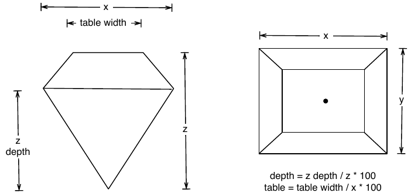

---
title: "ggplot - Statistical transformations"
subtitle: "session 6a"
author: "Eviatar Guttman"
date: "Last updated: `r format(Sys.time(), '%d-%m-%Y')`"  
output: 
  html_document: 
    toc: yes
    toc_depth: 3
    toc_float: yes
    number_sections: yes
    toc_collapsed: no
    smooth_scroll: yes
    fig_caption: yes
    highlight: tango
    theme: flatly
    css: ../style.css
urlcolor: blue
editor_options: 
  chunk_output_type: console
---  
```{r setup, include = F}
# global chunk options
knitr::opts_chunk$set(echo = TRUE,
                      warning = TRUE,
                      message = TRUE,
                      error = TRUE,
                      tidy=TRUE,
                      fig.align = 'center',
                      collapse = TRUE,
                      fig.width = 5,
                      fig.asp = 5/7)

# don't show NA's in tables
options(knitr.kable.NA = '')

```

```{r, message=FALSE}
library(tidyverse); library(patchwork)
```

# visualising distributions
<div dir="rtl">  
אופן הצגת התפלגות תלוי בשאלה האם משתנה הוא רציף או קטגורי (בדיד, דיסקרטי).   
משתנה הוא קטגורי אם הוא יכול לקבל מספר ערכים מצומצם. משתנים קטגוריים בד"כ שמורים כ- factor או character. 
</div>    
  
# bar charts  
## intro
<div dir="rtl">  
בכדי להציג התפלגויות נעבוד עם טבלת הנתונים `diamonds`
</div>    
```{r}
head(diamonds)
```
<div dir="rtl">  
הטבלה כוללת נתוני מחירים ומאפיינים של כ-54 אלף יהלומים. ארבעה פרמטרים של איכות: carat, cut, colur, clarity, ו-5 אמות מידה פיסיות, x, y ,z depth, table: 
</div>    
```{r echo=FALSE, out.width='100%'}

```
  
<br>    
<div dir="rtl">  
בכדי לבחון התפלגות של משתנה קטגורי נשתמש ב-bar chart:
</div>    
```{r}
ggplot(data = diamonds) + geom_bar(mapping = aes(x = cut))
```

:::{.blue-box}
<div dir="rtl">  
יש שני סוגים של גרפים הנקראים בד"כ barplot. הגרף שהצגנו מקבל data שלא עבר סכימה, וכל תצפית תורמת יחידה אחת של גובה לכל bar. הסוג האחר של barplot משמש לנתונים שעברו סכימה מראש, וגובה העמודה מייצג את הערך בנתונים.   
למשל: 
</div>    
```{r}
drugs <- data.frame(
  drug = c("a", "b", "c"),
  effect = c(4.2, 9.7, 6.1))
```
<div dir="rtl">  
במקרה זה אולי כדאי להשתמש ב-`geom_point`. זה צורך פחות מקום להצגת הנתונים וציר ה-y לא צריך להכיל את הערך 0. 
</div>    
```{r}
p1 <- ggplot(drugs, aes(drug, effect)) + geom_bar(stat = "identity")
p2 <- ggplot(drugs, aes(drug, effect)) + geom_point()
p1 + p2
```
:::
  
    
<div dir="rtl">  
נשוב ל- `diamonds`.  
המשתנה `count` הוא לא חלק מבסיס הנתונים.   
Bar charts, histograms and frequency polygons מחלקים את הנתונים ל-bins ואז מציגים בגרף את מספר התצפיות שיש בכל bin.   
  
Smoothers כמו שהשתמשנו כאשר עשינו גרף עם `geom_smooth` אומדים מודל על הנתונים ומציגים את התחזית של המודל.   
  
Boxplots מחשבים סטטיסטיים המסכמים את ההתפלות ואז מציגים זאת בקופסה מעוצבת.   
  
האלגוריתם המשמש לחישוב ערכים חדשים לגרף נקרא __stat__ , קיצור ל-statistical transformation. 
</div>    

```{r echo=FALSE, out.width='100%'}
knitr::include_graphics('./6_images/visualization-stat-bar.png')
```

<div dir="rtl">  
המשתנה שהציג את התפלגות ה-`cut` ב-`diamonds` הוא: 
</div>    
```{r}
diamonds %>% count(cut)
```
<div dir="rtl">  
לכן, ניתן להציג את אותו הגרף באמצעות הקוד: 
</div>    
```{r}
p1 <- diamonds %>% count(cut) %>% 
  ggplot() + geom_bar(aes(cut, n), stat = 'identity')
```
<div dir="rtl">  
ניתן לראות באמצעות איזה __stat__  ה-`geom`  משתמש אם בודקים את ארגומנט ברירת המחדל של ה-`geom` באמצעות `?geom_bar`. בדיקה של ה-help של הפונקציה מראה שה-`stat` הוא `count`. ב-help של הפונקציה אפשר לבדוק גם את ה"משתנים המחושבים" שה-geom יוצר.  
אפשרות נוספת היא להשתמש ב-`ggplot_built`. 
</div>    
```{r}
p1_data <-ggplot_build(p1)
p1_data[["data"]]
```
<div dir="rtl">  
`ggplot_built` זו פונקציה שיוצרת אובייקט המכיל את כל המידע ששימש לבניית הגרף.   
למעשה, ניתן להציג את אותו הגרף תוך הוספת layer באמצעות פונקציה בשם `stat_count`, אשר ברירת המחדל בארגומנט ה-geom שלה הוא `bar`.   
לכל `geom` יש סטטיסטי ברירת מחדל, ולכל `stat` יש `geom` ברירת מחדל. 
</div>    
```{r}
ggplot(diamonds, aes(cut)) + stat_count()
```

<div dir="rtl">  
סיבות לכך שנרצה להשתמש ב-stat באופן מפורש הן: שאולי נרצה לדרוס את ברירת המחדל ולבחור סטטיסטי אחר, או שאולי נרצה להסב את תשומת הלב לטרנספורמציה הסטטיסטית שהגרף עושה: 
</div>    
```{r}
ggplot(data = diamonds) + 
  geom_bar(mapping = aes(x = cut, y = stat(prop), group = 1))
```

```{r}
ggplot(data = diamonds) + 
  stat_summary(
    mapping = aes(x = cut, y = depth),
    fun.min = min,
    fun.max = max,
    fun = median
  )
```

## position adjustments
<div dir="rtl">  
`scale_color` צובע נקודות וקווים. 
`scale_fill` צובע שטחים. 
</div>    
```{r, fig.width= 7}
p1 <- ggplot(data = diamonds) + 
  geom_bar(mapping = aes(x = cut, colour = cut)) +
  guides(color = "none")

p2 <- ggplot(data = diamonds) + 
  geom_bar(mapping = aes(x = cut, colour = cut), size = 2)

# better use fill
p3 <- ggplot(data = diamonds) + 
  geom_bar(mapping = aes(x = cut, fill = cut))

p1 + p2 + p3  + plot_layout(ncol = 2)
```
<div dir="rtl">  
אפשר לצבוע באמצעות משתנה אחר מטבלת הנתונים. 
</div>    
```{r}
ggplot(data = diamonds) + 
  geom_bar(mapping = aes(x = cut, fill = clarity))

```
<div dir="rtl">  
יש שלוש אפשרויות למיקום ה-bars בגרף: "identity", "dodge", and "fill".   
"ideneity" לא ממש מועיל בדוגמא זו. 
</div>    
```{r, fig.width=7}
p1 <- ggplot(data = diamonds, mapping = aes(x = cut, fill = clarity)) + 
  geom_bar(alpha = 1/5, position = "identity")
p2 <- ggplot(data = diamonds, mapping = aes(x = cut, colour = clarity)) + 
  geom_bar(fill = NA, position = "identity")
p1 + p2
```
<div dir="rtl">  
`position = "fill"` עורם את הערכים זה על זה והופך את כל ה bars להיות באותו גובה. זה מועיל כאשר רוצים להשוות פרופורציות בין קבוצות. 
</div>    
```{r}
ggplot(data = diamonds) + 
  geom_bar(mapping = aes(x = cut, fill = clarity), position = "fill")
```
<div dir="rtl">  
`position = "dodge"` ממקם רכיבים חופפים זה ליד זה. זה מאפשר להשוות בין ערכים שונים. 
</div>    
```{r}
ggplot(data = diamonds) + 
  geom_bar(mapping = aes(x = cut, fill = clarity), position = "dodge")
```

# histograms
## intro
<div dir="rtl">
משתנה הוא רציף אם הוא יכול לקבל ערך כלשהו מקבוצת ערכים אינסופית וסדורה.   
כדי לבחון התפלגות של משתנה רציף נשתמש בהיסטוגרמה.   
</div>    
```{r}
ggplot(data = diamonds) +
  geom_histogram(mapping = aes(x = carat), binwidth = 0.5)

```
<div dir="rtl">  
אפשר לחשב את הנתונים הללו ידנית תוך שילוב של `dplyr::count` ו- `ggplot2::cut_width`:
</div>    
```{r}
(his_count <- diamonds %>% count(cut_width(carat, 0.5)))

ggplot(his_count, aes(x = `cut_width(carat, 0.5)`, y = n)) + geom_col(width = 1) + 
  theme(axis.text.x  = element_text(angle = 90))
```

<div dir="rtl">  
היסטוגרמה מחלקת את ציר x ל-bins בגדלים שווים ואז משתמשת בגובה ה-bar כדי להציג את מספר התצפיות שנפלו בתוך כל bin.
  
כדאי להתנסות במספרי bins שונים, משום ש-bins ברוחב שונים יכולים לגלות תבניות שונות בנתונים  
</div>

```{r}
smaller <- diamonds %>% 
  filter(carat < 3)
  
ggplot(data = smaller, mapping = aes(x = carat)) +
  geom_histogram(binwidth = 0.1)
```
<div dir="rtl">  
כאשר מציגים את הנתונים, לא לשכוח לכלול מידע על פרמטרים חשובים כגון רוחב ה-bin ב-caption של הגרף.  
</div>    
<br>
<div dir="rtl">  
`geom_freqpoly` מבצע את אותם חישובים כמו `geom_histogram` אך מציג את ה counts באמצעות קווים במקום bars. יותר קל לראות קווים חופפים מאשר bars חופפים. 
</div>    
```{r}
ggplot(data = smaller, mapping = aes(x = carat, colour = cut)) +
  geom_freqpoly(binwidth = 0.1)
```

<div dir="rtl">  
האינדיקציה לקיומן של תצפיות חריגות (outliers) היא כאשר גבולות הגרף רחבים.
</div>    
```{r}
ggplot(diamonds) + 
  geom_histogram(mapping = aes(x = y), binwidth = 0.5)
```
 
<div dir="rtl">  
נבצע זום אין באמצעות `coord_cartesian`: 
</div>    
```{r}
ggplot(diamonds) + 
  geom_histogram(mapping = aes(x = y), binwidth = 0.5) +
  coord_cartesian(ylim = c(0, 50))
```
<div dir="rtl">  
נזכור שהפונקציות `xlim`, `ylim`, `lims` עובדות אחרת, הן משמיטות תצפיות מחוץ לגבול.
</div>


## missing values
<div dir="rtl">  
איך נתייחס לערכים חסרים?   
אפשר להשמיט את כל השורה בה יש ערכים לא שגרתיים. 
</div>    
```{r}
diamonds2 <- diamonds %>% 
  filter(between(y, 3, 20))

ggplot(data = diamonds2) +
  geom_histogram(mapping = aes(x = carat), binwidth = 0.1)

```

<div dir="rtl">  
רק בגלל שערך אחד בתצפיות הוא לא סביר, לא אומר שצריך לזרוק את כל התצפית.  כאשר בסיס הנתונים באיכות נמוכה, השמטת תצפיות כל פעם שאחת המדידות לא סבירה תביא לכך שבסוף יישארו מעט נתונים.   
כדאי להחליף את הערכים הלא סבירים בערכים חסרים. 
</div>    

```{r}
diamonds2 <- diamonds %>% 
  mutate(y = if_else(y < 3 | y > 20, NA_real_, y))
```
<div dir="rtl">  
ל- `if_else` יש שלושה ארגומנטים אשר על המשתמש להזין . הראשון הוא תנאי לוגי , השני הוא הוא הפעולה שתבוצע עם התנאי הוא `TRUE` והשלישי הוא הפעולה במקרה שהוא `FALSE`.  (יש גם ארגומנט רביעי המציין מה לעשות כאשר הוזן ערך `NA` לתוך התנאי הלוגי).   
אם יש צורך ביותר משתי חלופות של תנאים, אפשר להשתמש ב-`case_when`.   
  
יש לשים לב לערכים חסרים המושמטים מהתרשים. אמנם ggplot לא מציגה אותם בגרף אך היא כן מדפיסה message  או warning בקונסולה המציין שהיו ערכים שהוסרו.

</div>    
```{r}
ggplot(data = diamonds2, mapping = aes(x = x, y = y)) + 
  geom_point()
```
<div dir="rtl">  
אנו רוצים לדעת מה הופך תצפיות עם ערכים חסרים לשונות. לדוגמא ב-filghts, ערכים חסרים ב-`dep_time` מייצגים טיסות שבוטלו.  
אולי נרצה להשוות בין זמנים מתוכננים של טיסות שיצאו לבין אלה שלא יצאו. 
</div>    
```{r}
nycflights13::flights %>% 
  mutate(
    cancelled = is.na(dep_time),
    sched_hour = sched_dep_time %/% 100,
    sched_min = sched_dep_time %% 100,
    sched_dep_time = sched_hour + sched_min / 60
  ) %>% 
  ggplot(mapping = aes(sched_dep_time)) + 
    geom_freqpoly(mapping = aes(colour = cancelled), binwidth = 1/4)
```


## densityes
<div dir="rtl">  
היסטוגרמות (וגם פוליגונים המשמשים כהיסטוגרמה דו-ממדית) עושות טרנספורמציה סטטיסטית שנקראת  `stat = bin`. הסטטיסטי הזה יוצר שני משתנים:  count  ו- density .     
ברירת המחדל היא ש- count ממופה לציר ה-y, משום שהוא ניתן לפרשנות בקלות.  
Density זה ה-count מחולק בסך כל ה-counts מוכפל ברוחב ה-bin. כך, שטח הגרף מנורמל ל-1.     
Density טוב לשימוש כאשר רוצים להשוות בין צורה של התפלגות מבלי להתייחס למספר התצפיות הכללי.     
`geom_density` יוצר מעין התפלגות נורמלית בכל נקודה וסוכם את העקומות. בשל כך, קשה יותר לקשר בינו ובין הנתונים המקוריים.  
נשתמש ב-density plot כאשר אנו יודעים שההתפלגות חלקה, רציפה ולא חסומה.   
</div>   
   
```{r, fig.width = 7}
p1 <- ggplot(diamonds, aes(depth)) +
  geom_density(na.rm = TRUE) + 
  xlim(58, 68) + 
  theme(legend.position = "none")

p2 <- ggplot(diamonds, aes(depth, fill = cut, colour = cut)) +
  geom_density(alpha = 0.2, na.rm = TRUE) + 
  xlim(58, 68) + 
  theme(legend.position = "none")

p1 + p2
```
<div dir="rtl">  
משום שהשטח של כל עקומה מנורמל ל-1, אנו מאבדים קשר עם הגודל היחסי של כל קבוצה. 
</div>    
# box plots
<div dir="rtl">  
לעיתים רוצים להשוות מספר רב של התפלגויות. במקרים אלה אפשר לבחור בשיטות המתפשרות באיכות בכדי להציג כמות.   
Box plot מראה חמישה סטטיסטיים ותצפיות חריגות. 
</div>    
```{r echo=FALSE, out.width='100%'}
knitr::include_graphics('./6_images/boxplot.png')
```

```{r}
ggplot(data = mpg) +
  geom_boxplot(mapping = aes(x = reorder(class, hwy, FUN = median), y = hwy)) 
```
<div dir="rtl">  
Box plot הוא פתרון טוב להציג משתנה רציף מחולק לקטגוריות של משתנה בדיד.   
כאשר רוצים להציג שני משתנים רציפים, אחת החלופות היא  scatter plot.
</div>    
```{r}
ggplot(diamonds, aes(carat, price)) + geom_point()
```
<div dir="rtl">  
Scatter plot מועיל פחות כאשר גודל הנתונים עולה.  
אפשר לשחק עם פרמטר ה-alpha בכדי להציג יותר נתונים על הגרף
</div>  
  
```{r}
ggplot(diamonds, aes(carat, price)) + geom_point(alpha = 1/20)

```

<div dir="rtl">  
פתרון נוסף הוא להשתמש ב- `geom_bin2d` כדי ליצור bins בצורת ריבועים.   
אפשר להשתמש ב -`geom_hex` כדי ליצור bins בצורת משושים. וכן, ישנם פתרונות נוספים בהרחבות ל-ggplot. 
</div>    
```{r}
diamonds %>% filter(carat < 3) %>%
  ggplot(aes(carat, price)) + geom_bin2d()

library(hexbin)
diamonds %>% filter(carat < 3) %>%
  ggplot(aes(carat, price)) + geom_hex()

```
<div dir="rtl">  
חלופה נוספת היא לעשות bining למשתנה רציף כאילו היה משתנה קטגורי
</div>    
```{r}
diamonds %>% filter(carat < 3) %>%
  ggplot(aes(carat, price)) + geom_boxplot(aes(group = cut_width(carat, 0.1)))
```
<div dir="rtl">  
`cut_width` מחלק את x ל-bins
</div>    
```{r}
diamonds %>% filter(carat < 3) %>% mutate(cut_carat = cut_width(carat, 0.1))

```
<div dir="rtl">  
החיסרון ב-box plot הוא שזה אותו גרף עבור קבוצות תצפיות בגדלים שונים. אפשר להשתמש `varwidth` כדי לעשות את גודל ה-box פרופורציוני לשורש הריבועי של מספר התצפיות: 
</div>    
```{r}
diamonds %>% filter(carat < 3) %>%
  ggplot(aes(carat, price)) + geom_boxplot(aes(group = cut_width(carat, 0.1)), varwidth = T)
```
<div dir="rtl">  
אפשר להשתמש ב-`cut_number` כדי לחלק את הנתונים לקבוצות שוות גודל. 
</div>    
```{r}
diamonds %>% filter(carat < 3) %>%
  ggplot(aes(carat, price)) + geom_boxplot(aes(group = cut_number(carat, 20)))

```

# overplotting  
<div dir="rtl">  
בתרשים הבא, יש נקודות חופפות
</div>    
```{r}
ggplot(mpg, aes(displ, hwy)) + geom_point()
```
<div dir="rtl">  
אפשר להוסיף jitter לגרף, זה מוסיף רעש רנדומאלי למיקום של כל נקודה. 
</div>    
```{r}
ggplot(data = mpg) + 
  geom_point(mapping = aes(x = displ, y = hwy), position = "jitter")

```
<div dir="rtl">  
כאשר יש מעט נתונים זה הופך את הגרף לפחות מדויק, אך כשיש הרבה נתונים זה הופך את הגרף ליותר גלוי. 
</div>    

# collective geoms
<div dir="rtl">  
Collective geom מציג מספר תצפיות עם אובייקט גיאומטרי אחד.   
ברירת המחדל עבור ה-group aesthetic היא לאינטראקציה בין כל המשתנים הבדידים בגרף.   
יש מקרים שזה לא מספיק.     
  
הנה נתוני פאנל על גובה של נערים: 
</div>    
```{r}
data(Oxboys, package = "nlme")
head(Oxboys)

```
<div dir="rtl">  
אפשר לראות שהפרטים הופכים גבוהים יותר כשהמדידות מתקדמות
</div>    
```{r}
ggplot(Oxboys, aes(age, height, group = Subject)) + 
  geom_point() + 
  geom_line()
```
<div dir="rtl">  
מבלי לעשות  group נקבל: 
</div>    
```{r}
ggplot(Oxboys, aes(age, height)) + 
  geom_point() + 
  geom_line()
```
<div dir="rtl">  
אם רוצים לעשות אינטראקציה בין שני משתנים ניתן לעשות זאת בשימוש הפונקציה `interaction` באופן הבא: 
</div>    
`aes(group = interaction(school_id, student_id))` 
<div dir="rtl">  
בדוגמא הזו נרצה לקבץ כל פרט בנפרד. אפשר לשים את ארגומט ה-group ב-geom המסוים: 
</div>    
```{r}
ggplot(Oxboys, aes(age, height)) + 
  geom_line(aes(group = Subject)) + 
  geom_smooth(method = "lm", size = 2, se = FALSE)

```
<div dir="rtl">  
מה אם ציר ה –x הוא דיסקרטי? 
</div>    
```{r}
ggplot(Oxboys, aes(Occasion, height)) + 
  geom_boxplot()
```
<div dir="rtl">  
`occasion` הוא משתנה דיסקרטי, `geom_line` לא יעבוד
</div>    
```{r}
ggplot(Oxboys, aes(Occasion, height)) + 
  geom_boxplot() +
  geom_line(colour = "#3366FF", alpha = 0.5)
```
<div dir="rtl">  
`geom_line` עושה גרף קווים המחבר נקודות משמאל לימין. ה-group aesthetic קובע אילו תצפיות מחוברות זו לזו.   
`geom_path` מחבר נקודות בסדר שהן מופיעות בנתונים. 
  
עלינו לומר ל ggplot כיצד לחבר את התצפיות. למשל, נרצה קו אחד לכל פרט: 
</div>    
```{r}
ggplot(Oxboys, aes(Occasion, height)) + 
  geom_boxplot() +
  geom_line(aes(group = Subject), colour = "#3366FF", alpha = 0.5)
```

# exercises  
<div dir="rtl">    
1. חקור את התפלגות המחיר (price) של יהלומים. האם גילית משהו לא רגיל או מפתיע? רמז, בדוק `binwidth`  שונים.   
  
2. כמה יהלומים הם 0.99 קראט? כמה עם 1 קראט? מדוע לדעתך יש הבדל?     
  
3. השווה בין `coord_cartezian` לבין `xlim` and `ylim` כאשר עושים zoom in על היסטוגרמה. מה קורה אם משאירים את ה `binwidth` ללא שינוי? מה קורה אם עושים זום כך שרואים רק חצי מה-bar?   
  
4. מה קורה לערכים חסרים בהיסטוגרמה? מה קורה לערכים חסרים ב-bar plot? מדוע יש הבדל?  
   
5. השווה בין `geom_vilolin` לבין היסטוגרמה מחולקת ל-`facets` לבין `geom_freqpoly` מחולק לצבעים. מה היתרונות והחסרונות של כל אחת מהאפשרויות. (לצורך התרגיל ניתן להציג התפלגויות של price לפי cut).      
    

6. הצג את ההתפלגות של קראט בפילוח לפי מחיר היהלומים.  

7. כאשר טבלת הנתונים קטנה, לעיתים נח להשתמש ב- `geom_jitter` בכדי לראות את הקשר בין משתנה רציף ומשתנה קטגורי. בחבילה ggbeeswarm יש מספר אפשרויות דומות ל- geom_jitter. בחן את האפשרויות שהחבילה מציעה.  
     
8. תוך שימוש בטבלת הנתונים mpg צור גרף של `hwy` עבור כל ערך של `cyl` מבלי להפוך את המשתנה `cyl` ל-factor. באיזה aesthetic צריך להשתמש?     
9. שנה את הגרף הבא כך שיתקבל boxplot לכל ערך שלם של displ.  
</div>    

```{r, eval=FALSE}
ggplot(mpg, aes(displ, cty)) + 
  geom_boxplot()
```


<div dir="rtl">    
10. כשהצגנו barplot  עם פרופורציות של –cut מתוך כלל היהלומים, השתמשנו ב- `group = 1`.  מדוע?   
    
11. כמה bars  יש בכל אחד מהגרפים הבאים?   
(רמז: כדי לתחום את חלקי ה-bars  השתמש ב- `color = "white"`).    
</div>       
```{r, eval = F}
ggplot(mpg, aes(drv)) + 
  geom_bar()

ggplot(mpg, aes(drv, fill = hwy, group = hwy)) + 
  geom_bar()

mpg2 <- mpg %>% arrange(hwy) %>% mutate(id = seq_along(hwy)) 

ggplot(mpg2, aes(drv, fill = hwy, group = id)) + 
  geom_bar()

```


